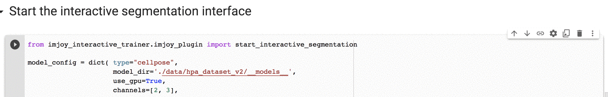

[](https://imjoy.io/#/app?workspace=sandbox&plugin=https://raw.githubusercontent.com/imjoy-team/imjoy-interactive-segmentation/master/interactive-ml-demo.imjoy.html)
[](https://mybinder.org/v2/gh/imjoy-team/imjoy-interactive-segmentation/master?filepath=Tutorial.ipynb)
[](https://colab.research.google.com/github/imjoy-team/imjoy-interactive-segmentation/blob/master/Tutorial.ipynb)

## ImJoy-powered Interactive Segmentation

This project enables deep learning powered interactive segmentation with ImJoy.

For more details, read our article on f1000 research: [Interactive biomedical segmentation tool powered by deep learning and ImJoy](https://f1000research.com/articles/10-142).


[Watch the tutorial video](https://widgets.figshare.com/articles/13721410/embed?show_title=1)

## Key feature
* Using ImJoy as an interface for data loading and annotation
* Track training progress and guide the model throughout training

Therefore, users can encourage the model to learn by feeding in appropriate data (eg. worse-performing samples).

## Getting started
To get started, we recommend to watch the [tutorial video](https://widgets.figshare.com/articles/13721410/embed?show_title=1).


Then, you can try the tool yourself by running the tutorial notebook in Google Colab: [](https://colab.research.google.com/github/imjoy-team/imjoy-interactive-segmentation/blob/master/Tutorial.ipynb). You won't need to install anything locally, however, you will need to open the notebook in **Chrome** or **FireFox** (we do not support Safari for now).

## Installation

If you use the tool in your own computer or server, you will need Anaconda or Miniconda installed. Then run the following command to install the library:

```bash
conda create -n interactive-ml python=3.7.2 -y
conda activate interactive-ml

pip install git+https://github.com/imjoy-team/imjoy-interactive-segmentation@master#egg=imjoy-interactive-trainer

python3 -m ipykernel install --user --name imjoy-interactive-ml --display-name "ImJoy Interactive ML"
```
## Usage

Start a the jupyter notebook server:
```bash
jupyter notebook
```

Now you can either [download the tutorial notebook](https://github.com/imjoy-team/imjoy-interactive-segmentation/blob/master/Tutorial.ipynb), or follow the instructions below to create a notebook manually.

You can now open your jupyter notebook in **Chrome** or **FireFox** (**Note: we DO NOT support Safari for now due to a bug**).

Importantly, create a notebook file with kernel spec named "ImJoy Interactive ML".

Inside the notebook, you can download our example dataset by running:

```python
# this will save the example dataset to `./data/hpa_dataset_v2`
from imjoy_interactive_trainer.data_utils import download_example_dataset
download_example_dataset()
```

To start the interactive annotation tool, run the following code in a cell:
```python
from imjoy_interactive_trainer.imjoy_plugin import start_interactive_segmentation

model_config = dict( type="cellpose",
                     model_dir='./data/hpa_dataset_v2/__models__',
                     use_gpu=True,
                     channels=[2, 3],
                     style_on=0,
                     batch_size=1,
                     default_diameter=100,
                     pretrained_model=False, # here you can set to None or a file path if you want to use pretrained model
                     resume=False) # set resume to True if you want to resume the last model when you started

start_interactive_segmentation(model_config,
                               "./data/hpa_dataset_v2",
                               ["microtubules.png", "er.png", "nuclei.png"],
                               object_name="cell",
                               scale_factor=1.0)
```

In the annotation interface, follow these steps:
 1. Annotate a few images by clicking "Get image" and use the markup tool to draw the cell outline. **You can SKIP this step if you are using the example dataset**, because we have already added 4 annotated images to bootstrap the training.
 1. Click "Start Training" to start the trainer, you can switch to the "Training" tab to see the training loss chart. Wait for a few seconds, and you should see new loss values being added to the chart.
 1. Now we can annotating new images by first click "Get an Image", then click "Predict". With the predicted mask, we can use the markup tools to correct the annotation. For example, you can use polygon tool to add new objects, select and press delete button to remove objects, or use the cutter to split one object into two.
 1. After manual correction, click "Send for Training" and repeat the last step until you are satisfied with the model performance.
### Switch on fullscreen mode in Google Colab

In Google Colab, you can use the annotation tool in fullscreen mode, here is how you can switch on it:




### How to cite

```
Ouyang W, Le T, Xu H and Lundberg E. Interactive biomedical segmentation tool powered by deep learning and ImJoy [version 1; peer review: 1 approved]. F1000Research 2021, 10:142 (https://doi.org/10.12688/f1000research.50798.1)
```